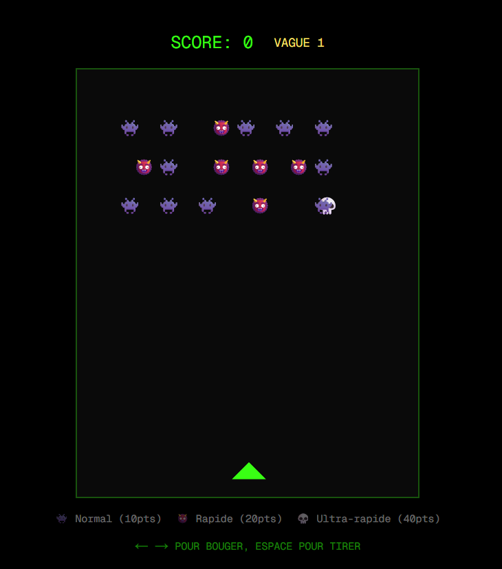

# Space Invaders

Un clone de Space Invaders développé avec Next.js, React et TypeScript, avec une boucle de jeu maison (pas de moteur de jeu externe).



🎮 **[Jouer à la démo](https://space-invaders-tau-seven.vercel.app/)**

## Contrôles

- **← / →** : déplacer le vaisseau
- **Espace** : tirer

## Fonctionnalités

- Boucle de jeu à 60 FPS (`requestAnimationFrame`)
- Vagues d'ennemis infinies, avec difficulté progressive
- 3 classes d'ennemis avec vitesse et valeur en points croissantes : Normal (10 pts), Rapide (20 pts), Ultra-rapide (40 pts)
- Détection de collisions (tirs joueur/ennemis, ennemis/joueur)
- Gestion d'état via hooks React (`useState`, `useRef`) pour séparer le rendu du calcul de jeu

## Stack technique

- **Next.js** (App Router)
- **React**
- **TypeScript**
- **Tailwind CSS**

## Lancer le projet en local

```bash
git clone https://github.com/PierreBoudraa/space-invaders.git
cd space-invaders
npm install
npm run dev
```

Ouvre [http://localhost:3000](http://localhost:3000) dans ton navigateur.

## Ce que ce projet démontre

- Gestion d'une boucle de jeu performante en React (éviter les re-renders inutiles à chaque frame en combinant `useRef` pour l'état du jeu et `useState` pour ce qui doit déclencher un rendu)
- Logique de collision et de spawn d'ennemis
- Structuration d'un projet Next.js/TypeScript
